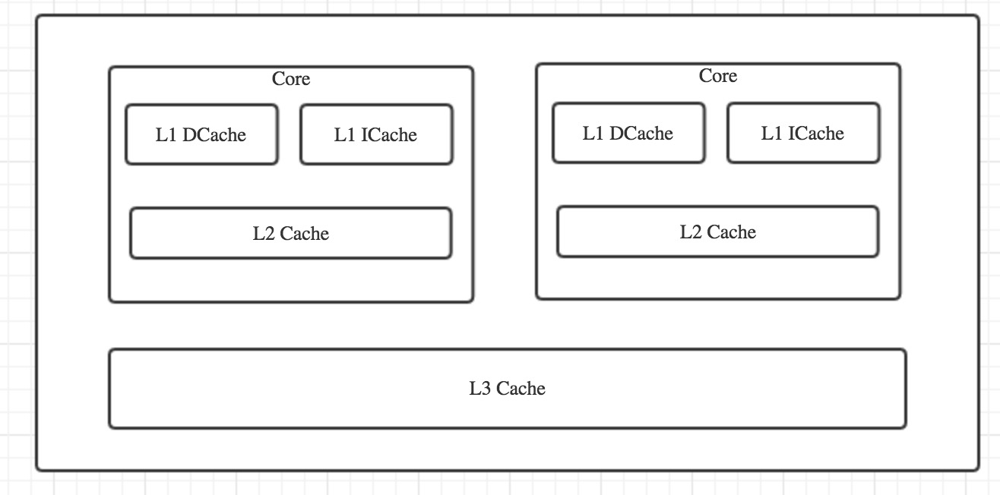
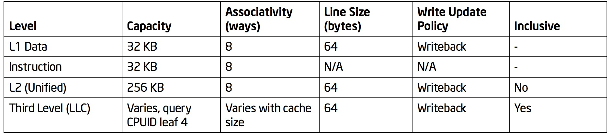

## CPU
### CPU Hierarchy

如下是两核 CPU 的结构图：



每个核心包括 L1 instruction cache(L1 ICache), L1 data cache(L1 DCache) 和一个 L2 Cache。若开启超线程技术，同一核内的两个逻辑处理器将共享 L1 DCache。L2 Cache 由数据和指令共享，所有核共享 L3 Cache(即 Last Level Cache，又称为 LLC)。这些 Cache 使用 ITLB, DTLB 和 STLB 来将线性地址转变为逻辑地址。对于 Intel® 64 and IA-32 而言，其 Cache 相关参数如下：



CPU Cache 缓存最小单位是一个缓存行，一般一个缓存行为 64 字节。可通过如下方式查看 CPU 相关参数：

```
// cpu 缓存行大小
# cat /sys/devices/system/cpu/cpu0/cache/index0/coherency_line_size
64
# cat /sys/devices/system/cpu/cpu0/cache/index0/type
Data
# cat /sys/devices/system/cpu/cpu0/cache/index0/size
32K
# cat /sys/devices/system/cpu/cpu0/cache/index1/type
Instruction
# cat /sys/devices/system/cpu/cpu0/cache/index1/size
32K
# cat /sys/devices/system/cpu/cpu0/cache/index2/size
256K
# cat /sys/devices/system/cpu/cpu0/cache/index3/size
10240K
```

### Cache Hit
各级cache latency。


如32-36行代码所示，每次开始内循环时，从内存抓取的数据块实际上覆盖了longs[i][0]到longs[i][5]的全部数据（刚好64字节）。因此，内循环时所有的数据都在L1缓存可以命中，遍历将非常快。

 

假如，将32-36行代码注释而用25-29行代码代替，那么将会造成大量的缓存失效。因为每次从内存抓取的都是同行不同列的数据块（如longs[i][0]到longs[i][5]的全部数据），但循环下一个的目标，却是同列不同行（如longs[0][0]下一个是longs[1][0]，造成了longs[0][1]-longs[0][5]无法重复利用）。运行时间的差距如下图，单位是微秒(us)：


### 参考
- [Intel® 64 and IA-32 Architectures Optimization Reference Manual](http://www.intel.com/content/dam/www/public/us/en/documents/manuals/64-ia-32-architectures-optimization-manual.pdf)
- [CPU cache](https://en.wikipedia.org/wiki/CPU_cache)
- [Where exactly L1, L2 and L3 Caches located in computer?](https://superuser.com/questions/196143/where-exactly-l1-l2-and-l3-caches-located-in-computer)
